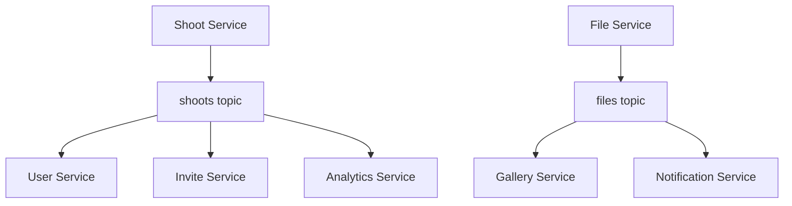

# ADR-009: Kafka for Event-Driven Microservices Communication

## Status

Accepted

## Date

2025-08-09

## Context

Our photography platform's microservices need to communicate asynchronously to handle complex business workflows. The shoot creation flow involves multiple services: shoot-service → user-service → invite-service → notification-service. We need a reliable, scalable event streaming platform.

### Business Requirements
- **Shoot invitation flow**: shoot.created → user.created/verified → invite.created → invite.sent
- **File processing pipeline**: file.uploaded → file.processed → gallery.updated
- **Audit trail**: All business events must be permanently stored
- **Service decoupling**: Services shouldn't directly depend on each other

### Technical Requirements
- Handle high-throughput photography file events
- Guaranteed message delivery
- Event replay capability for debugging
- Support for event sourcing patterns (ADR-019)
- Horizontal scalability

### Alternatives Considered

**Apache Kafka:**
- High-throughput, distributed streaming platform
- Persistent log storage with replay capability
- Strong consistency guarantees
- Excellent TypeScript client (KafkaJS)

**RabbitMQ:**
- Traditional message broker
- Simpler setup but less scalable
- Limited replay capabilities

**Redis Pub/Sub:**
- In-memory, very fast
- No persistence guarantees
- No replay capability

**AWS EventBridge/SQS:**
- Managed service, no operational overhead
- Vendor lock-in concerns
- Higher latency for on-premises deployment

## Decision

We will use **Apache Kafka** as the primary event streaming platform for microservices communication in the photography platform.

## Rationale

### Event Sourcing Support
Kafka's log-based storage perfectly supports our event sourcing requirements (ADR-019):
```javascript
// Events are permanently stored and replayable
const shootEvents = await kafka.consumer()
  .subscribe({ topic: 'shoots' })
  .run({
    eachMessage: async ({ partition, message }) => {
      const event = JSON.parse(message.value.toString());
      // Process shoot.created, shoot.updated, shoot.completed...
    }
  });
```

### High-Throughput Photography Workflows
Photography platforms generate high-volume events:
- File upload events (multiple files per shoot)
- Image processing events (thumbnails, watermarks, resizing)
- Gallery access events (viewing, downloading)

Kafka handles **millions of events per second** with low latency.

### Service Decoupling
Kafka enables true microservice independence:


### Event Replay & Debugging
Kafka's persistent log allows replaying events for:
- **Debugging production issues**
- **Reprocessing failed events**
- **Building new read models**
- **Migrating service logic**

### TypeScript Integration
KafkaJS provides excellent TypeScript support:
```typescript
import { Kafka, Producer, Consumer } from 'kafkajs';

const kafka = new Kafka({
  clientId: 'shoot-service',
  brokers: ['localhost:9092']
});

// Type-safe event publishing
const producer: Producer = kafka.producer();
await producer.send({
  topic: 'shoots',
  messages: [{
    partition: 0,
    key: shoot.id,
    value: JSON.stringify(shootCreatedEvent),
    headers: {
      eventType: 'shoot.created',
      version: '1.0.0'
    }
  }]
});
```

## Implementation Guidelines

### Topic Design
Following AsyncAPI schema definitions (ADR-023):
```yaml
# Topic structure
shoots:          # Shoot lifecycle events
  - shoot.created
  - shoot.updated  
  - shoot.completed
  - shoot.delivered

users:           # User management events
  - user.created
  - user.verified
  - user.updated

invites:         # Invitation workflow events
  - invite.created
  - invite.sent
  - invite.accepted

files:           # File processing events
  - file.uploaded
  - file.processed
  - file.deleted
```

### Event Publisher Pattern
```typescript
// src/shared/messaging/event-publisher.ts
export class EventPublisher {
  private producer: Producer;

  constructor(private kafka: Kafka) {
    this.producer = kafka.producer();
  }

  async publish<T>(topic: string, event: T, key: string): Promise<void> {
    await this.producer.send({
      topic,
      messages: [{
        key,
        value: JSON.stringify(event),
        headers: {
          eventType: (event as any).eventType,
          timestamp: new Date().toISOString()
        }
      }]
    });
  }
}
```

### Event Consumer Pattern
```typescript
// src/events/consumers/user-created.consumer.ts
export class UserCreatedConsumer {
  private consumer: Consumer;

  constructor(kafka: Kafka) {
    this.consumer = kafka.consumer({ groupId: 'invite-service' });
  }

  async subscribe(): Promise<void> {
    await this.consumer.subscribe({ topic: 'users' });
    
    await this.consumer.run({
      eachMessage: async ({ message }) => {
        const event = JSON.parse(message.value!.toString());
        
        if (event.eventType === 'user.created') {
          await this.handleUserCreated(event);
        }
      }
    });
  }
}
```

### Error Handling & Retry Logic
```typescript
// Dead letter queue pattern
const dlqProducer = kafka.producer();

try {
  await processEvent(event);
} catch (error) {
  // Send to dead letter queue for manual investigation
  await dlqProducer.send({
    topic: 'dead-letter-queue',
    messages: [{
      value: JSON.stringify({
        originalEvent: event,
        error: error.message,
        timestamp: new Date().toISOString()
      })
    }]
  });
}
```

### Development Environment
```yaml
# docker-compose.yml
version: '3.8'
services:
  zookeeper:
    image: confluentinc/cp-zookeeper:7.4.0
    environment:
      ZOOKEEPER_CLIENT_PORT: 2181
  
  kafka:
    image: confluentinc/cp-kafka:7.4.0
    depends_on:
      - zookeeper
    ports:
      - "9092:9092"
    environment:
      KAFKA_BROKER_ID: 1
      KAFKA_ZOOKEEPER_CONNECT: zookeeper:2181
      KAFKA_ADVERTISED_LISTENERS: PLAINTEXT://localhost:9092
```

## Configuration Management

### Production Configuration
```typescript
// config/kafka.config.ts
export const kafkaConfig = {
  development: {
    brokers: ['localhost:9092'],
    retry: { retries: 3 }
  },
  production: {
    brokers: process.env.KAFKA_BROKERS!.split(','),
    ssl: true,
    sasl: {
      mechanism: 'SCRAM-SHA-256',
      username: process.env.KAFKA_USERNAME!,
      password: process.env.KAFKA_PASSWORD!
    },
    retry: { retries: 10 }
  }
};
```

### Topic Management
```typescript
// Automatic topic creation with proper configuration
const admin = kafka.admin();
await admin.createTopics({
  topics: [
    {
      topic: 'shoots',
      numPartitions: 3,
      replicationFactor: 1,
      configEntries: [
        { name: 'retention.ms', value: '604800000' } // 7 days
      ]
    }
  ]
});
```

## Monitoring & Operations

### Health Checks
```typescript
// Health check endpoint
app.get('/health/kafka', async (request, reply) => {
  try {
    const admin = kafka.admin();
    const metadata = await admin.fetchTopicMetadata();
    reply.send({ status: 'healthy', topics: metadata.topics.length });
  } catch (error) {
    reply.code(503).send({ status: 'unhealthy', error: error.message });
  }
});
```

### Metrics Collection
- Consumer lag monitoring
- Message throughput metrics
- Error rate tracking
- Topic partition distribution

## Migration Strategy

### Phase 1: Core Services (Immediate)
- Implement Kafka in shoot-service for shoot.created events
- Add Kafka to invite-service for invitation workflow
- Set up development Kafka cluster

### Phase 2: Event Streaming (Month 2)
- Migrate all business events to Kafka topics
- Implement event replay mechanisms
- Add comprehensive monitoring

### Phase 3: Advanced Features (Month 3)
- Event sourcing implementation
- Complex event processing
- Stream analytics for business insights

## Trade-offs

### Accepted Trade-offs
- **Operational complexity** of running Kafka cluster
- **Learning curve** for event-driven patterns
- **Eventual consistency** instead of immediate consistency

### Benefits Gained
- **True microservice decoupling**
- **Event replay capability** for debugging
- **High throughput** for photography workflows
- **Audit trail** for all business events

## Consequences

### Positive
- Services can evolve independently
- Event-driven architecture supports complex workflows
- Built-in audit trail for business events
- Horizontal scalability for high-volume photography operations

### Negative
- Additional infrastructure to manage and monitor
- Debugging distributed workflows is more complex
- Need to handle eventual consistency patterns

### Neutral
- Event schemas must be versioned and backward compatible
- Monitoring and alerting systems need updating
- Development environment setup becomes more complex

## Compliance

This decision will be enforced through:
- Service templates with Kafka integration
- Event schema validation using AsyncAPI (ADR-023)
- Code review guidelines for event publishing patterns
- Infrastructure automation for Kafka deployment