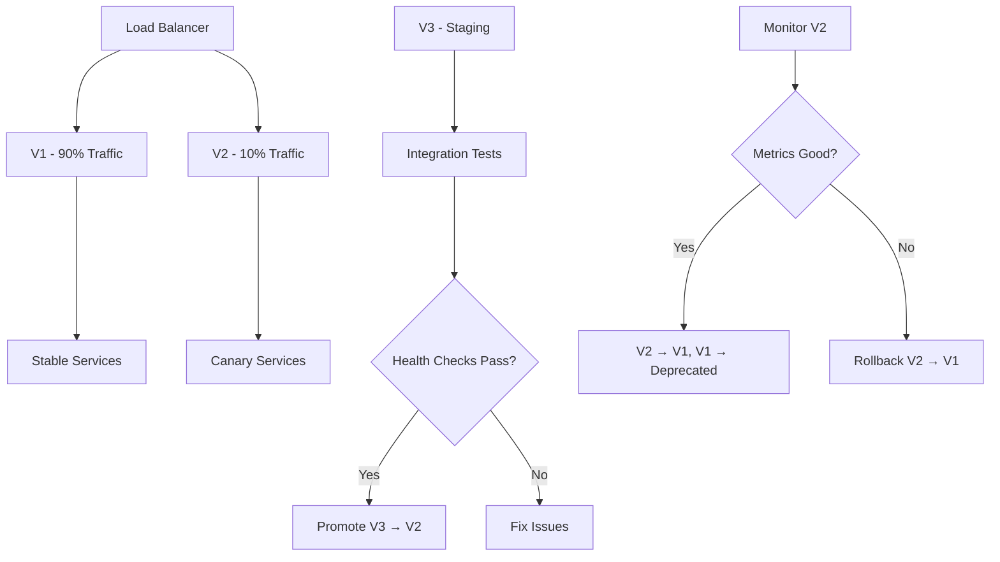

# ADR-017: Progressive Deployment Strategy (V1 → V2 → V3)

## Status

Accepted

## Date

2025-08-09

## Context

Our photography platform serves critical business functions for professional photographers who cannot afford downtime during shoots, client deliveries, or gallery access. We need a deployment strategy that minimizes risk while allowing rapid iteration and feature delivery.

### Business Requirements
- **Zero-downtime deployments** during active photo shoots
- **Rapid rollback capability** if issues are detected
- **Gradual feature rollout** to validate business impact
- **Client gallery availability** must be maintained 24/7
- **File processing continuity** for ongoing uploads

### Technical Challenges
- **Microservice coordination** during deployments
- **Database migration safety** with photography metadata
- **File system consistency** during storage updates
- **Event stream continuity** for business workflows
- **Load balancing** during partial deployments

### Current Risks
- Monolithic deployments affecting entire platform
- No automated rollback mechanisms
- Limited ability to test features with real users
- Database migration failures causing data loss

## Decision

We will implement a **Progressive Deployment Strategy** with three distinct phases (V1 → V2 → V3) that gradually transitions users and traffic while maintaining full system availability and providing automated rollback capabilities.

## Rationale

### Three-Phase Deployment Model

**V1 (Current/Stable)**: Production traffic serves existing functionality
**V2 (Canary)**: Limited traffic tests new features with monitoring
**V3 (Next)**: Staged environment for integration testing



### Photography-Specific Deployment Considerations

Photography platforms have unique requirements that influence deployment strategy:

**Client Gallery Availability:**
```yaml
# Deployment constraint: Never interrupt gallery access
deployment_constraints:
  gallery_service:
    - maintain_minimum_replicas: 2
    - max_unavailable: 0
    - rolling_update_strategy: true
    
  file_service:
    - require_storage_sync: true
    - validate_file_access: true
```

**Active Shoot Protection:**
```typescript
// Pre-deployment check for active shoots
interface ActiveShootCheck {
  checkActiveShots(): Promise<boolean>;
  blockDeploymentDuringShoot(shootIds: string[]): void;
  scheduleDeploymentWindow(): Date;
}

// Deployment blocker for critical business operations
const canDeploy = await Promise.all([
  checkNoActiveUploads(),
  checkNoProcessingJobs(),
  checkNoActiveClientSessions()
]);
```

## Implementation Architecture

### V1: Production Environment (Stable)

```yaml
# V1 Configuration - Production Stable
version: "v1"
environment: production
traffic_allocation: 90%
deployment_frequency: weekly
rollback_time: < 2 minutes

services:
  shoot-service:
    replicas: 3
    version: stable
    health_checks:
      readiness: /health/ready
      liveness: /health/live
      
  gallery-service:
    replicas: 4  # Higher replica count for client access
    version: stable
    sticky_sessions: true  # Maintain user sessions
```

### V2: Canary Environment (Testing)

```yaml
# V2 Configuration - Canary Testing
version: "v2"
environment: canary
traffic_allocation: 10%
deployment_frequency: daily
features:
  - feature_flags_enabled: true
  - advanced_monitoring: true
  - user_feedback_collection: true

routing_rules:
  # Route specific user segments to canary
  - user_type: "beta_photographers"
    allocation: 100%
  - user_type: "internal_team"
    allocation: 100%
  - user_type: "regular_users"
    allocation: 5%
```

### V3: Staging Environment (Integration)

```yaml
# V3 Configuration - Staging Integration
version: "v3"
environment: staging
traffic_allocation: 0%  # No production traffic
deployment_frequency: multiple_per_day

testing_suite:
  - unit_tests: required
  - integration_tests: required
  - e2e_tests: required
  - performance_tests: required
  - security_scans: required
```

## Deployment Pipeline Architecture

### Automated Pipeline Flow

```yaml
# .github/workflows/progressive-deployment.yml
name: Progressive Deployment Pipeline

on:
  push:
    branches: [main]

jobs:
  # Phase 1: Deploy to V3 (Staging)
  deploy-v3:
    runs-on: ubuntu-latest
    environment: staging
    steps:
      - name: Deploy to Staging
        run: kubectl apply -f k8s/staging/
        
      - name: Run Integration Tests
        run: npm run test:e2e:staging
        
      - name: Security Scan
        run: npm run scan:security
        
      - name: Performance Baseline
        run: npm run test:performance:baseline

  # Phase 2: Promote to V2 (Canary)
  promote-v2:
    needs: deploy-v3
    environment: canary-approval
    runs-on: ubuntu-latest
    steps:
      - name: Deploy to Canary
        run: |
          kubectl set image deployment/shoot-service \
            shoot-service=${{ env.IMAGE_TAG }} \
            --namespace=canary
            
      - name: Configure Traffic Split
        run: kubectl apply -f k8s/traffic-split-10-90.yaml
        
      - name: Monitor Canary Metrics
        run: npm run monitor:canary
        timeout-minutes: 30

  # Phase 3: Promote to V1 (Production)
  promote-v1:
    needs: promote-v2
    environment: production-approval
    runs-on: ubuntu-latest
    steps:
      - name: Gradual Traffic Shift
        run: |
          # 10% → 25% → 50% → 75% → 100%
          for allocation in 25 50 75 100; do
            kubectl apply -f k8s/traffic-split-$allocation-$(( 100 - allocation )).yaml
            sleep 300  # 5 minute intervals
            npm run monitor:health-check
          done
          
      - name: Deprecate Previous Version
        run: kubectl delete deployment shoot-service-prev
```

### Rollback Automation

```typescript
// Automated rollback system
interface RollbackTrigger {
  errorRate: number;      // > 1% error rate
  latency: number;        // > 500ms p95 latency
  businessMetrics: {
    uploadFailures: number;  // > 5% failure rate
    galleryAccess: number;   // < 95% availability
  };
}

class AutomatedRollback {
  async monitorCanaryHealth(): Promise<void> {
    const metrics = await this.collectMetrics();
    
    if (this.shouldRollback(metrics)) {
      await this.executeRollback();
      await this.notifyTeam('Automated rollback executed', metrics);
    }
  }
  
  private shouldRollback(metrics: CanaryMetrics): boolean {
    return (
      metrics.errorRate > 0.01 ||
      metrics.p95Latency > 500 ||
      metrics.uploadFailureRate > 0.05 ||
      metrics.galleryAvailability < 0.95
    );
  }
  
  private async executeRollback(): Promise<void> {
    // Immediate traffic redirection
    await this.updateTrafficSplit(0, 100);  // 0% canary, 100% stable
    
    // Scale down canary deployment
    await this.scaleDeployment('canary', 0);
    
    // Alert monitoring systems
    await this.triggerAlert('ROLLBACK_EXECUTED');
  }
}
```

## Traffic Management Strategy

### Intelligent Routing

```yaml
# Istio VirtualService for progressive traffic routing
apiVersion: networking.istio.io/v1beta1
kind: VirtualService
metadata:
  name: shoot-service-routing
spec:
  http:
  - match:
    - headers:
        user-type:
          exact: "beta-photographer"
    route:
    - destination:
        host: shoot-service
        subset: canary
      weight: 100
        
  - match:
    - headers:
        feature-flag:
          exact: "new-gallery-ui"
    route:
    - destination:
        host: gallery-service
        subset: canary
      weight: 100
        
  - route:
    - destination:
        host: shoot-service
        subset: stable
      weight: 90
    - destination:
        host: shoot-service 
        subset: canary
      weight: 10
```

### Feature Flag Integration

```typescript
// Progressive feature rollout with deployment coordination
interface FeatureRollout {
  name: string;
  deploymentPhase: 'v3' | 'v2' | 'v1';
  userSegments: string[];
  rolloutPercentage: number;
  killSwitch: boolean;
}

class ProgressiveFeatureManager {
  async rolloutFeature(feature: FeatureRollout): Promise<void> {
    // Phase 1: Enable in V3 (staging) for testing
    if (feature.deploymentPhase === 'v3') {
      await this.enableInStaging(feature);
    }
    
    // Phase 2: Gradual rollout in V2 (canary)
    if (feature.deploymentPhase === 'v2') {
      await this.enableForSegments(feature.userSegments, feature.rolloutPercentage);
    }
    
    // Phase 3: Full rollout in V1 (production)
    if (feature.deploymentPhase === 'v1') {
      await this.enableForAllUsers(feature);
    }
  }
  
  async killSwitchActivated(featureName: string): Promise<void> {
    // Immediate feature disable without deployment
    await this.disableFeatureFlag(featureName);
    await this.notifyTeam(`Feature ${featureName} disabled via kill switch`);
  }
}
```

## Database Migration Strategy

### Safe Schema Evolution

```typescript
// Progressive database migrations
interface MigrationStrategy {
  phase: 'v3' | 'v2' | 'v1';
  backward_compatible: boolean;
  rollback_strategy: string;
}

// Example: Adding new field to shoot metadata
// Phase 1 (V3): Add optional field
ALTER TABLE shoots ADD COLUMN priority VARCHAR(20) DEFAULT NULL;

// Phase 2 (V2): Populate field for new records
// Application code handles both null and populated values

// Phase 3 (V1): Make field required (if needed)
// After validating all records have values
ALTER TABLE shoots ALTER COLUMN priority SET NOT NULL;

// Rollback strategy: Each phase can be reversed independently
```

### Data Consistency Checks

```typescript
// Automated data validation during deployments
class DataConsistencyChecker {
  async validateMigration(migration: Migration): Promise<boolean> {
    const checks = [
      this.validateSchemaChanges(),
      this.validateDataIntegrity(),
      this.validateBusinessRules(),
      this.validatePerformanceImpact()
    ];
    
    const results = await Promise.all(checks);
    return results.every(check => check.passed);
  }
  
  private async validateBusinessRules(): Promise<ValidationResult> {
    // Photography-specific validations
    const shootIntegrity = await this.validateShootReferences();
    const fileIntegrity = await this.validateFileReferences();
    const clientAccess = await this.validateClientPermissions();
    
    return {
      passed: shootIntegrity && fileIntegrity && clientAccess,
      details: { shootIntegrity, fileIntegrity, clientAccess }
    };
  }
}
```

## Monitoring and Observability

### Deployment Health Metrics

```typescript
// Photography-specific deployment metrics
interface DeploymentMetrics {
  // Technical metrics
  errorRate: number;
  responseTime: number;
  throughput: number;
  
  // Business metrics
  uploadSuccessRate: number;
  galleryAccessibility: number;
  clientSatisfactionScore: number;
  photographerProductivity: number;
  
  // Photography-specific metrics
  imageProcessingLatency: number;
  thumbnailGenerationSuccess: number;
  fileCorruptionRate: number;
}

// Alert thresholds for rollback triggers
const ROLLBACK_THRESHOLDS = {
  errorRate: 0.01,              // 1% error rate
  uploadFailures: 0.05,         // 5% upload failure rate
  galleryDowntime: 0.02,        // 2% gallery unavailability
  imageCorruption: 0.001        // 0.1% corruption rate
};
```

### Business Impact Monitoring

```yaml
# Business metrics dashboard
business_metrics:
  shoot_completion_rate:
    target: "> 98%"
    rollback_threshold: "< 95%"
    
  client_gallery_access:
    target: "< 2s load time"
    rollback_threshold: "> 5s load time"
    
  file_processing_pipeline:
    target: "< 30s for standard photos"
    rollback_threshold: "> 60s processing time"
    
  revenue_impact:
    target: "no decrease during deployment"
    rollback_threshold: "> 5% revenue drop"
```

## Deployment Schedule Strategy

### Photography Business-Aware Scheduling

```typescript
// Deployment scheduling around business patterns
interface DeploymentWindow {
  day: string;
  time: string;
  rationale: string;
  restrictions: string[];
}

const DEPLOYMENT_SCHEDULE: DeploymentWindow[] = [
  {
    day: 'Tuesday',
    time: '10:00 AM UTC',
    rationale: 'Mid-week, after weekend shoots processed',
    restrictions: ['No wedding season (May-September Saturdays)']
  },
  {
    day: 'Thursday', 
    time: '02:00 PM UTC',
    rationale: 'Before weekend shoot preparations',
    restrictions: ['Avoid holiday weekends']
  }
];

// Automatic deployment blocking during peak times
class BusinessAwareScheduler {
  async canDeploy(): Promise<boolean> {
    const now = new Date();
    
    // Block deployments during wedding season weekends
    if (this.isWeddingSeason(now) && this.isWeekend(now)) {
      return false;
    }
    
    // Block during known high-traffic periods
    if (this.isHolidayPeriod(now)) {
      return false;
    }
    
    return true;
  }
}
```

## Rollback Procedures

### Automated Rollback Triggers

```typescript
// Multi-level rollback strategy
enum RollbackSeverity {
  IMMEDIATE = 'immediate',    // < 30 seconds
  FAST = 'fast',             // < 2 minutes  
  STANDARD = 'standard'      // < 5 minutes
}

interface RollbackScenario {
  trigger: string;
  severity: RollbackSeverity;
  action: string;
}

const ROLLBACK_SCENARIOS: RollbackScenario[] = [
  {
    trigger: 'File corruption detected',
    severity: RollbackSeverity.IMMEDIATE,
    action: 'Traffic to stable, investigate file system'
  },
  {
    trigger: 'Gallery unavailable',
    severity: RollbackSeverity.IMMEDIATE,
    action: 'Client-facing services to stable immediately'
  },
  {
    trigger: 'Error rate > 1%',
    severity: RollbackSeverity.FAST,
    action: 'Gradual traffic reduction, monitor improvement'
  },
  {
    trigger: 'Performance degradation',
    severity: RollbackSeverity.STANDARD,
    action: 'Scale investigation, prepare rollback if needed'
  }
];
```

## Trade-offs

### Accepted Trade-offs
- **Infrastructure complexity** with multiple environment management
- **Deployment velocity reduction** through staged rollouts
- **Resource overhead** running multiple versions simultaneously

### Benefits Gained
- **Risk mitigation** through gradual rollouts and automated rollbacks
- **Business continuity** with zero-downtime deployments
- **Data protection** through progressive database migrations
- **User experience consistency** during platform updates

## Consequences

### Positive
- Elimination of deployment-related downtime for photography business
- Rapid rollback capabilities minimize business impact of issues
- Gradual feature rollouts enable data-driven product decisions
- Automated monitoring prevents manual oversight failures

### Negative
- Increased operational complexity requiring DevOps expertise
- Higher infrastructure costs running multiple environments
- Longer deployment cycles compared to direct production deployment

### Neutral
- Development workflow changes to accommodate progressive strategy
- Team training required for new deployment procedures
- Monitoring and alerting systems require comprehensive updates

## Compliance

This decision will be enforced through:
- **Automated pipeline** preventing direct production deployments
- **Environment gates** requiring approval for production promotion
- **Monitoring requirements** with automated rollback triggers
- **Business schedule integration** preventing deployments during critical periods