# Architecture Documentation
## Temps D'arrêt Studio - Photography Platform

**Document Version:** 1.0 (ARC42 Compliant)  
**Date:** 2024-08-14  
**Architecture Team:** Solution Architecture  
**ARC42 Version:** 8.0  

---

# 1. Introduction and Goals

## 1.1 Requirements Overview

Temps D'arrêt Studio requires a modern photography platform to showcase professional work and deliver services to clients. The system must handle large photography files (25MB+ RAW images), provide secure client access, and support the complete photography business workflow.

### Key Functional Requirements
- **Portfolio Management**: Public showcase with SEO optimization for client acquisition
- **Client Portal**: Secure, passwordless access to private photo galleries via magic links
- **File Management**: Upload, process, and deliver 25MB+ RAW files with multi-resolution variants
- **Archive Services**: Generate and deliver 50-300GB complete photo collections
- **Guest Sharing**: Client-initiated sharing with role-based permission restrictions
- **Communication**: Automated email notifications and workflow status updates

### Driving Forces
- **Business Growth**: Professional online presence driving new client acquisition
- **Client Experience**: Seamless, mobile-first photo access and download experience
- **Operational Efficiency**: Automated workflows reducing manual administrative tasks
- **Cost Control**: Self-hosted infrastructure avoiding recurring cloud storage fees
- **Data Privacy**: Complete control over client files and personal information

## 1.2 Quality Goals

| Priority | Quality Goal | Motivation | Target Metric |
|----------|--------------|------------|---------------|
| 1 | **Performance** | Fast photo access critical for client satisfaction | < 2s page load, < 1s navigation |
| 2 | **Security** | Client data protection essential for trust | Zero unauthorized access incidents |
| 3 | **Usability** | Simple access reduces support overhead | < 2 clicks to photos, passwordless auth |
| 4 | **Reliability** | System availability critical for business operations | 99.5% uptime, automated recovery |
| 5 | **Cost Efficiency** | Sustainable infrastructure costs for small business | 70% cost reduction vs cloud alternatives |

## 1.3 Stakeholders

| Role | Contact | Expectations |
|------|---------|-------------|
| **Photographer/Owner** | Business Owner | Complete administrative control, automated workflows, professional online presence |
| **Clients** | Primary Customers | Easy photo access, fast downloads, secure file sharing, archive delivery |
| **Guests** | Invited by Clients | Simple photo viewing, print-quality downloads without registration |
| **Development Team** | Technical Implementation | Clear architecture, maintainable code, comprehensive documentation |
| **System Administrator** | Operations | Reliable deployment, monitoring capabilities, backup procedures |

---

# 2. Constraints

## 2.1 Technical Constraints

| Constraint | Consequence | Negotiable? |
|------------|-------------|-------------|
| **Node.js 24+ Runtime** | All services must use compatible dependencies and features | No - Performance and security requirements |
| **TypeScript Strict Mode** | Type safety enforced across all code, impacts development speed | No - Code quality requirement |
| **MongoDB Document Database** | Data modeling must fit document structure, no ACID transactions | Partially - Could migrate to PostgreSQL |
| **Self-hosted Infrastructure** | Limited to single-server deployment initially, affects scalability | No - Core business requirement |
| **25MB+ File Processing** | Memory and storage requirements, async processing mandatory | No - Photography industry standard |

## 2.2 Organizational Constraints

| Constraint | Consequence | Negotiable? |
|------------|-------------|-------------|
| **Single Developer Team** | Limited parallel development, affects delivery timeline | Partially - Budget dependent |
| **4-month Delivery Timeline** | Feature scope must be prioritized, MVP approach required | No - Business launch requirement |
| **Monorepo Structure** | All code in single repository, shared dependencies | Yes - Could split into multiple repos |
| **TDD Development Approach** | Test-first development, affects initial velocity | No - Quality requirement |
| **Weekly Sprint Cycles** | Feature delivery in 1-week increments | Yes - Could adjust to 2-week sprints |

## 2.3 Political/Regulatory Constraints

| Constraint | Consequence | Negotiable? |
|------------|-------------|-------------|
| **GDPR Compliance** | Data protection controls, user consent mechanisms required | No - Legal requirement |
| **Photography Copyright Laws** | Client access controls, watermarking considerations | No - Legal requirement |
| **Self-hosting Requirement** | No cloud storage, complete data sovereignty | No - Business decision |
| **Open Source Technology** | Vendor independence, community support priority | Partially - Case-by-case basis |
| **Budget Limitations** | Infrastructure costs < €100/month, no enterprise licenses | Partially - ROI dependent |

---

# 3. Context and Scope

## 3.1 Business Context

```mermaid
graph TB
    subgraph "External Business Partners"
        PHOTOGRAPHER[👤 Photographer<br/>Business Owner]
        CLIENTS[👥 Clients<br/>Primary Customers]
        GUESTS[👥 Guests<br/>Invited by Clients]
        EMAIL_PROVIDER[📧 Email Service Provider<br/>SMTP/Email Delivery]
    end

    subgraph "Temps D'arrêt Studio Platform"
        SYSTEM[📸 Photography Platform<br/>Portfolio & Client Portal]
    end

    PHOTOGRAPHER -->|Manages shoots, uploads photos| SYSTEM
    PHOTOGRAPHER -->|Creates client invitations| SYSTEM
    SYSTEM -->|Sends magic link invitations| EMAIL_PROVIDER
    EMAIL_PROVIDER -->|Delivers emails| CLIENTS
    EMAIL_PROVIDER -->|Delivers emails| GUESTS
    CLIENTS -->|Access private galleries| SYSTEM
    CLIENTS -->|Download photos & archives| SYSTEM
    CLIENTS -->|Invite guests| SYSTEM
    GUESTS -->|View photos, limited downloads| SYSTEM
    SYSTEM -->|Public portfolio display| PHOTOGRAPHER
    
    classDef external fill:#e3f2fd,stroke:#1976d2,stroke-width:2px
    classDef system fill:#e8f5e8,stroke:#388e3c,stroke-width:3px
    
    class PHOTOGRAPHER,CLIENTS,GUESTS,EMAIL_PROVIDER external
    class SYSTEM system
```



### Business Context Description

| External Entity | Input to System | Output from System | Interface |
|------------------|------------------|-------------------|-----------|
| **Photographer** | Photo uploads, shoot metadata, client information | Gallery management interface, client status updates | Web portal, file upload |
| **Clients** | Gallery access requests, guest invitations | Photo galleries, archive downloads, invitation emails | Magic link authentication, web portal |
| **Guests** | Photo viewing, limited downloads | Print-quality photo access | Magic link authentication, web portal |
| **Email Provider** | Email delivery confirmations | Magic link emails, notifications | SMTP protocol |

## 3.2 Technical Context

```mermaid
graph TB
    subgraph "External Technical Systems"
        BROWSER[🌐 Web Browser<br/>Client Interface]
        SMTP_SERVER[📧 SMTP Server<br/>Email Delivery]
        FILE_SYSTEM[💾 Local File System<br/>Photo Storage]
        MONGODB[🗄️ MongoDB Instance<br/>Metadata Storage]
    end

    subgraph "Photography Platform System"
        WEB_FRONTEND[SvelteKit Frontend]
        API_GATEWAY[API Gateway/BFF]
        MICROSERVICES[Microservices Layer]
        EVENT_BUS[Kafka Event Bus]
    end

    BROWSER -->|HTTPS/REST| WEB_FRONTEND
    WEB_FRONTEND -->|HTTPS/REST| API_GATEWAY
    API_GATEWAY -->|HTTP/REST| MICROSERVICES
    MICROSERVICES -->|Event Publishing| EVENT_BUS
    MICROSERVICES -->|TCP Connection| MONGODB
    MICROSERVICES -->|File I/O| FILE_SYSTEM
    MICROSERVICES -->|SMTP| SMTP_SERVER
    
    classDef external fill:#fff3e0,stroke:#f57c00,stroke-width:2px
    classDef system fill:#e8f5e8,stroke:#388e3c,stroke-width:2px
    
    class BROWSER,SMTP_SERVER,FILE_SYSTEM,MONGODB external
    class WEB_FRONTEND,API_GATEWAY,MICROSERVICES,EVENT_BUS system
```



### Technical Context Description

| External System | Protocol/Interface | Data Format | Purpose |
|------------------|-------------------|-------------|---------|
| **Web Browser** | HTTPS/REST APIs | JSON, HTML, Images | User interface and file transfers |
| **SMTP Server** | SMTP/TLS | Email (MIME) | Magic link and notification delivery |
| **File System** | Direct I/O | Binary files, structured directories | Photo storage and archive management |
| **MongoDB** | TCP/MongoDB Wire Protocol | BSON documents | Business data and metadata persistence |

---

# 4. Solution Strategy

## 4.1 Technology Decisions

| Quality Goal | Scenario | Solution Approach | Link to Details |
|--------------|----------|------------------|-----------------|
| **Performance** | Large file uploads (25MB+) with progress tracking | Multi-resolution processing with Sharp, streaming uploads | [Section 8.6](#86-file-processing-concepts) |
| **Security** | Passwordless client access with role-based permissions | Magic link authentication with JWT and RBAC | [Section 8.2](#82-authentication-concepts) |
| **Usability** | Mobile-first photo gallery experience | Progressive web app with responsive design | [Section 5.1](#51-level-1---system-overview) |
| **Reliability** | Event-driven service coordination | Kafka message bus with dead letter queues | [Section 8.1](#81-event-driven-architecture) |
| **Cost Efficiency** | Self-hosted infrastructure avoiding cloud fees | Docker containerization with local file storage | [Section 7.1](#71-infrastructure-overview) |

## 4.2 Top-Level Decomposition

### Microservices Architecture Strategy
- **Event-driven services** communicating via Kafka for loose coupling
- **Schema-first development** using TypeSpec for API consistency
- **Self-contained services** owning their data and business logic
- **Progressive migration** from monolith (V1) to microservices (V2)

### Technology Stack Rationale
```yaml
Frontend: SvelteKit + TypeScript + TailwindCSS
  Rationale: Modern, performant, type-safe web development

Backend: Fastify + TypeScript + Node.js 24+
  Rationale: High-performance, type-safe backend development

Data: MongoDB + Mongoose + Local File System
  Rationale: Flexible document storage + cost-effective file storage

Integration: Kafka + TypeSpec + Zod
  Rationale: Event-driven architecture + schema consistency

Deployment: Docker + Docker Compose + Nginx
  Rationale: Containerized deployment + self-hosted infrastructure
```

---

# 5. Building Block View

## 5.1 Level 1 - System Overview

```mermaid
graph TB
    subgraph "External Users"
        USERS[👥 Users<br/>Photographer, Clients, Guests]
    end

    subgraph "Photography Platform System"
        subgraph "Presentation Layer"
            WEB[Web Frontend<br/>SvelteKit Portal]
        end
        
        subgraph "API Layer"
            GATEWAY[API Gateway<br/>Request Router & Auth Proxy]
        end
        
        subgraph "Business Services"
            AUTH[Authentication Services<br/>User & Invite Management]
            BUSINESS[Business Services<br/>Shoots, Files, Portfolio]
            COMM[Communication Services<br/>Notifications & Email]
        end
        
        subgraph "Integration Platform"
            EVENTS[Event Platform<br/>Kafka Message Bus]
            SCHEMA[Schema Platform<br/>TypeSpec Contracts]
        end
        
        subgraph "Data Layer"
            DATABASE[Database<br/>MongoDB]
            STORAGE[File Storage<br/>Local File System]
        end
    end

    subgraph "External Systems"
        EMAIL[📧 Email Service<br/>SMTP Provider]
    end

    USERS -->|HTTPS| WEB
    WEB -->|REST API| GATEWAY
    GATEWAY -->|Service Calls| AUTH
    GATEWAY -->|Service Calls| BUSINESS
    GATEWAY -->|Service Calls| COMM
    
    AUTH -->|Events| EVENTS
    BUSINESS -->|Events| EVENTS
    COMM -->|Events| EVENTS
    
    EVENTS -->|Event Delivery| AUTH
    EVENTS -->|Event Delivery| BUSINESS
    EVENTS -->|Event Delivery| COMM
    
    SCHEMA -->|API Contracts| GATEWAY
    SCHEMA -->|Type Definitions| AUTH
    SCHEMA -->|Type Definitions| BUSINESS
    
    AUTH -->|Data Access| DATABASE
    BUSINESS -->|Data Access| DATABASE
    BUSINESS -->|File Access| STORAGE
    COMM -->|Email Delivery| EMAIL

    classDef external fill:#e3f2fd,stroke:#1976d2,stroke-width:2px
    classDef presentation fill:#fff3e0,stroke:#f57c00,stroke-width:2px
    classDef business fill:#e8f5e8,stroke:#388e3c,stroke-width:2px
    classDef integration fill:#f3e5f5,stroke:#7b1fa2,stroke-width:2px
    classDef data fill:#fce4ec,stroke:#c2185b,stroke-width:2px

    class USERS,EMAIL external
    class WEB,GATEWAY presentation
    class AUTH,BUSINESS,COMM business
    class EVENTS,SCHEMA integration
    class DATABASE,STORAGE data
```



### Level 1 - Building Block Descriptions

#### Web Frontend (Black Box)
**Purpose**: User interface for photographers, clients, and guests
- **Responsibility**: Responsive web application providing portfolio showcase and client portal
- **Interface**: HTTPS REST API consumption, file upload handling
- **Quality/Performance**: < 2s initial load, mobile-first responsive design

#### API Gateway (Black Box)  
**Purpose**: Request routing and authentication proxy
- **Responsibility**: Route requests to appropriate services, validate authentication
- **Interface**: REST API endpoints, JWT token validation
- **Quality/Performance**: < 100ms routing latency, rate limiting protection

#### Authentication Services (Black Box)
**Purpose**: User management and magic link authentication
- **Responsibility**: User lifecycle, magic link generation, role-based access control
- **Interface**: User management APIs, authentication validation
- **Quality/Performance**: < 5s magic link delivery, 99.9% authentication reliability

#### Business Services (Black Box)
**Purpose**: Core photography business logic
- **Responsibility**: Shoot management, file processing, portfolio curation
- **Interface**: Business logic APIs, file processing endpoints
- **Quality/Performance**: 25MB+ file support, < 60s multi-resolution processing

#### Communication Services (Black Box)
**Purpose**: Notifications and external communication
- **Responsibility**: Email delivery, template management, status notifications
- **Interface**: Notification APIs, email template management
- **Quality/Performance**: < 5s email delivery, 99% delivery success rate

## 5.2 Level 2 - Business Services (White Box)

### Motivation
The Business Services building block contains the core domain logic for photography operations. It's decomposed into specialized services to enable independent scaling and development.


### Level 2 - Service Descriptions

#### User Service (Black Box)
- **Purpose**: User lifecycle management and authentication
- **Interface**: `/api/users/*`, `/api/auth/*`
- **Events Published**: `user.created`, `user.authenticated`, `user.session-expired`
- **Events Consumed**: `invite.accepted`, `shoot.created`
- **Data Owned**: Users collection, authentication tokens

#### Invite Service (Black Box)
- **Purpose**: Magic link generation and invitation workflow
- **Interface**: `/api/invites/*`
- **Events Published**: `invite.created`, `invite.sent`, `invite.accepted`, `invite.expired`
- **Events Consumed**: `shoot.created`, `user.created`
- **Data Owned**: Invitations collection, magic link tokens

#### Shoot Service (Black Box)
- **Purpose**: Photography session lifecycle management
- **Interface**: `/api/shoots/*`, `/api/galleries/*`
- **Events Published**: `shoot.created`, `shoot.updated`, `shoot.published`, `shoot.archived`
- **Events Consumed**: `file.uploaded`, `file.processed`, `user.created`
- **Data Owned**: Shoots collection, gallery metadata

#### File Service (Black Box)
- **Purpose**: Large file processing and archive generation
- **Interface**: `/api/files/*`, `/api/archives/*`
- **Events Published**: `file.uploaded`, `file.processed`, `archive.ready`, `file.downloaded`
- **Events Consumed**: `shoot.created`, `archive.requested`
- **Data Owned**: File metadata collection, file system storage

#### Portfolio Service (Black Box)
- **Purpose**: Public website content management
- **Interface**: `/api/portfolio/*`, `/api/public/*`
- **Events Published**: `portfolio.updated`, `portfolio.published`
- **Events Consumed**: `shoot.published`
- **Data Owned**: Portfolio content collection, public metadata

#### Notification Service (Black Box)
- **Purpose**: Email notifications and communication
- **Interface**: `/api/notifications/*`
- **Events Published**: `notification.sent`, `email.delivered`
- **Events Consumed**: `invite.created`, `shoot.ready`, `archive.ready`, `invite.expiring`
- **Data Owned**: Notification history, delivery status

---

# 6. Runtime View

## 6.1 Shoot Creation and Client Invitation

This scenario represents the core business workflow where a photographer creates a new photography session and invites the client for secure access.

```mermaid
sequenceDiagram
    participant P as Photographer
    participant WEB as Web Frontend
    participant GW as API Gateway
    participant SS as Shoot Service
    participant EB as Event Bus
    participant US as User Service
    participant IS as Invite Service
    participant NS as Notification Service
    participant EMAIL as Email Service

    Note over P,EMAIL: Core Business Flow: Shoot Creation → Client Invitation

    P->>WEB: Create new shoot (title, date, clientEmail)
    WEB->>GW: POST /api/shoots
    GW->>GW: Validate photographer authentication
    GW->>SS: CreateShootCommand
    
    SS->>SS: Generate shootId, validate data
    SS->>EB: Publish shoot.created event
    Note right of EB: {shootId, title, clientEmail, photographerId, date}
    SS->>GW: Return shoot details
    GW->>WEB: 201 Created (shoot data)
    WEB->>P: Shoot created confirmation

    EB->>US: Consume shoot.created event
    US->>US: Process client user creation/lookup
    alt Client doesn't exist
        US->>US: Create client user (role: 'client')
        US->>EB: Publish user.created event
        Note right of EB: {userId, email, role: 'client', shootId}
    else Client exists
        US->>EB: Publish user.verified event
        Note right of EB: {userId, email, shootId}
    end

    EB->>IS: Consume user.created/verified event
    IS->>IS: Generate magic link token (15min expiry)
    IS->>IS: Store invitation (email, shootId, token)
    IS->>EB: Publish invite.created event
    Note right of EB: {inviteId, email, shootId, token, expiresAt}

    EB->>NS: Consume invite.created event
    NS->>NS: Generate magic link URL
    NS->>NS: Compose invitation email
    NS->>EMAIL: Send invitation email
    EMAIL->>NS: Delivery confirmation
    NS->>EB: Publish invite.sent event
    Note right of EB: {inviteId, email, sentAt, status: 'sent'}
```



**Runtime Scenario Details:**
- **Trigger**: Photographer creates new photography session
- **Primary Flow**: Synchronous shoot creation followed by asynchronous invitation workflow
- **Event Flow**: `shoot.created` → `user.created/verified` → `invite.created` → `invite.sent`
- **Performance**: < 500ms shoot creation, < 5s invitation email delivery
- **Error Handling**: Failed email delivery triggers retry with exponential backoff

## 6.2 File Upload and Processing

This scenario handles large file uploads with asynchronous multi-resolution processing.

```mermaid
sequenceDiagram
    participant P as Photographer
    participant WEB as Web Frontend  
    participant GW as API Gateway
    participant FS as File Service
    participant STORAGE as File System
    participant EB as Event Bus
    participant SS as Shoot Service
    participant NS as Notification Service

    Note over P,NS: File Processing Flow: Upload → Processing → Notification

    P->>WEB: Upload photos (25MB+ files)
    WEB->>GW: POST /api/files/upload (multipart)
    GW->>FS: ProcessFileUpload (streaming)
    
    FS->>STORAGE: Store original file
    FS->>EB: Publish file.uploaded event
    Note right of EB: {fileId, shootId, originalPath, size, mimeType}
    FS->>GW: 202 Accepted (file metadata)
    GW->>WEB: Upload confirmation
    WEB->>P: Upload progress complete

    FS->>FS: Start async processing (Sharp)
    Note over FS: Generate: thumb (320px), medium (1024px), high (2048px)
    
    FS->>STORAGE: Store processed variants
    FS->>EB: Publish file.processed event
    Note right of EB: {fileId, shootId, variants: [thumb, medium, high, original]}

    EB->>SS: Consume file.processed event
    SS->>SS: Update shoot photo count
    SS->>EB: Publish shoot.ready event
    Note right of EB: {shootId, photoCount, status: 'ready'}

    EB->>NS: Consume shoot.ready event
    NS->>NS: Send client notification email
    NS->>EB: Publish notification.sent event
```



**Runtime Scenario Details:**
- **Trigger**: Photographer uploads photos to existing shoot
- **Streaming Upload**: Handles 25MB+ files without memory issues
- **Async Processing**: Multi-resolution generation doesn't block user interface
- **Event Coordination**: File processing completion triggers client notifications
- **Performance**: < 30s upload for 25MB file, < 60s processing time

## 6.3 Client Magic Link Access

This scenario demonstrates the passwordless authentication flow for client gallery access.


**Runtime Scenario Details:**
- **Trigger**: Client clicks magic link in email invitation
- **Security**: Token validation includes expiry and single-use checks
- **Role-based Access**: Download permissions enforced by user role
- **Performance**: < 2s authentication, < 1s gallery load
- **User Experience**: Seamless transition from email to gallery access

---

# 7. Deployment View

## 7.1 Infrastructure Overview

The system deploys on self-hosted infrastructure using containerization for consistency and scalability.

```mermaid
graph TB
    subgraph "Production Environment"
        subgraph "Host Server (Physical/VPS)"
            subgraph "Docker Containers"
                NGINX[Nginx Reverse Proxy<br/>:80, :443]
                FRONTEND[SvelteKit Frontend<br/>:3000]
                GATEWAY[API Gateway<br/>:3001]
                
                subgraph "Microservices"
                    USER[User Service<br/>:3002]
                    INVITE[Invite Service<br/>:3003]
                    SHOOT[Shoot Service<br/>:3004]
                    FILE[File Service<br/>:3005]
                    PORTFOLIO[Portfolio Service<br/>:3006]
                    NOTIFICATION[Notification Service<br/>:3007]
                end
                
                MONGODB[MongoDB<br/>:27017]
                KAFKA[Kafka<br/>:9092]
            end
            
            subgraph "Host File System"
                PHOTOS[/var/www/portfolio-files/<br/>Photo Storage]
                ARCHIVES[/var/www/archives/<br/>Archive Storage]
                BACKUPS[/var/backups/<br/>Database Backups]
            end
            
            subgraph "SSL Management"
                LETSENCRYPT[Let's Encrypt<br/>Certificate Auto-renewal]
            end
        end
    end

    subgraph "External Services"
        SMTP_EXTERNAL[SMTP Provider<br/>Email Delivery]
        CLIENTS[Client Browsers<br/>HTTPS Access]
    end

    CLIENTS -->|HTTPS :443| NGINX
    NGINX -->|Proxy| FRONTEND
    NGINX -->|Proxy /api/*| GATEWAY
    NGINX -->|Proxy /files/*| FILE
    
    GATEWAY --> USER
    GATEWAY --> INVITE
    GATEWAY --> SHOOT
    GATEWAY --> FILE
    GATEWAY --> PORTFOLIO
    GATEWAY --> NOTIFICATION
    
    USER --> MONGODB
    INVITE --> MONGODB
    SHOOT --> MONGODB
    PORTFOLIO --> MONGODB
    
    USER --> KAFKA
    INVITE --> KAFKA
    SHOOT --> KAFKA
    FILE --> KAFKA
    PORTFOLIO --> KAFKA
    NOTIFICATION --> KAFKA
    
    FILE --> PHOTOS
    FILE --> ARCHIVES
    MONGODB --> BACKUPS
    
    NOTIFICATION --> SMTP_EXTERNAL
    NGINX --> LETSENCRYPT

    classDef container fill:#e3f2fd,stroke:#1976d2,stroke-width:2px
    classDef storage fill:#e8f5e8,stroke:#388e3c,stroke-width:2px
    classDef external fill:#fff3e0,stroke:#f57c00,stroke-width:2px
    classDef security fill:#f3e5f5,stroke:#7b1fa2,stroke-width:2px

    class NGINX,FRONTEND,GATEWAY,USER,INVITE,SHOOT,FILE,PORTFOLIO,NOTIFICATION,MONGODB,KAFKA container
    class PHOTOS,ARCHIVES,BACKUPS storage
    class SMTP_EXTERNAL,CLIENTS external
    class LETSENCRYPT security
```

## 7.2 Development Environment


## 7.3 Production Environment Details

### Infrastructure Specifications

| Component | Technology | Resource Requirements | Purpose |
|-----------|------------|----------------------|---------|
| **Host Server** | Ubuntu 24.04 LTS, 16GB RAM, 1TB SSD | 2 CPU cores minimum | Container host and file storage |
| **Reverse Proxy** | Nginx 1.24+ | 512MB RAM | SSL termination, request routing |
| **Application Services** | Node.js 24+ containers | 256MB RAM each | Business logic processing |
| **Database** | MongoDB 7.0 | 2GB RAM, 100GB storage | Business data persistence |
| **Message Bus** | Apache Kafka 3.0 | 1GB RAM | Event-driven coordination |
| **File Storage** | Ext4 filesystem | 500GB available | Photo and archive storage |

### Network Configuration

```yaml
Port Mapping:
  80:   HTTP → HTTPS redirect
  443:  HTTPS → Nginx reverse proxy
  3001-3007: Internal service communication
  27017: MongoDB (internal only)
  9092:  Kafka (internal only)

SSL/TLS:
  Certificate: Let's Encrypt wildcard
  Renewal: Automated via certbot
  Protocols: TLS 1.2, TLS 1.3
  Ciphers: Modern cipher suite only

Firewall Rules:
  Inbound: 22 (SSH), 80 (HTTP), 443 (HTTPS)
  Outbound: 25/587 (SMTP), 443 (HTTPS), 53 (DNS)
  Internal: All containers communicate freely
```

### File System Layout

```
/var/www/
├── portfolio-files/           # Photo storage
│   ├── shoots/
│   │   └── {shootId}/
│   │       ├── original/      # RAW files (25MB+)
│   │       ├── high/         # 2048px processed
│   │       ├── medium/       # 1024px thumbnails  
│   │       └── thumb/        # 320px previews
│   └── archives/             # Generated ZIP files
│       └── {shootId}/
│           ├── complete.zip  # All files
│           ├── processed.zip # No RAW files
│           └── prints.zip    # Print quality only
├── backups/                  # Database backups
│   ├── daily/
│   ├── weekly/
│   └── monthly/
└── logs/                     # Application logs
    ├── nginx/
    ├── services/
    └── system/
```

---

# 8. Cross-cutting Concepts

## 8.1 Event-Driven Architecture

The system uses event-driven architecture to coordinate between microservices, enabling loose coupling and independent scaling.

### Event Publishing Pattern
```typescript
// Shared event publisher across all services
interface EventPublisher {
  publish<T>(topic: string, event: T): Promise<void>;
  subscribe<T>(topic: string, handler: EventHandler<T>): Promise<void>;
}

// Example: Shoot Service publishing events
class ShootService {
  async createShoot(data: CreateShootRequest): Promise<Shoot> {
    const shoot = await this.repository.create(data);
    
    await this.eventPublisher.publish('shoot.created', {
      shootId: shoot.id,
      title: shoot.title,
      clientEmail: shoot.clientEmail,
      photographerId: shoot.photographerId,
      createdAt: shoot.createdAt
    });
    
    return shoot;
  }
}
```

### Event Schema Definition
```typescript
// TypeSpec-generated event schemas
interface ShootCreatedEvent {
  eventId: string;
  timestamp: string;
  shootId: string;
  title: string;
  clientEmail: string;
  photographerId: string;
  createdAt: string;
}

interface FileProcessedEvent {
  eventId: string;
  timestamp: string;
  fileId: string;
  shootId: string;
  variants: {
    resolution: 'thumb' | 'medium' | 'high' | 'original';
    path: string;
    size: number;
  }[];
}
```

### Event Processing Guarantees
- **At-least-once delivery** via Kafka consumer groups
- **Idempotent handlers** prevent duplicate processing
- **Dead letter queues** for failed event processing
- **Event sourcing** provides complete audit trail

## 8.2 Authentication Concepts

### Magic Link Authentication Flow
The system implements passwordless authentication using time-limited magic links with JWT tokens.

```typescript
interface MagicLinkService {
  generateLink(email: string, shootId: string): Promise<MagicLink>;
  validateLink(token: string): Promise<AuthenticationResult>;
}

interface MagicLink {
  token: string;           // 64-char cryptographically secure token
  email: string;
  shootId: string;
  expiresAt: Date;        // 15-minute expiry
  usedAt?: Date;          // Single-use enforcement
}

interface AuthenticationResult {
  valid: boolean;
  user?: User;
  sessionToken?: string;   // JWT with 24-hour expiry
  error?: string;
}
```

### Role-Based Access Control
```typescript
enum UserRole {
  PHOTOGRAPHER = 'photographer',  // Full admin access
  CLIENT = 'client',              // Full shoot access + archive downloads
  GUEST = 'guest'                 // Limited access, print-quality only
}

interface PermissionMatrix {
  [UserRole.PHOTOGRAPHER]: ['admin', 'all_access'];
  [UserRole.CLIENT]: ['view_gallery', 'download_all', 'download_archive', 'invite_guest'];
  [UserRole.GUEST]: ['view_gallery', 'download_print_quality'];
}
```

## 8.3 Domain Model

### Core Photography Entities
```typescript
interface Shoot {
  id: string;                    // shoot_xxxx
  title: string;
  date: Date;
  location?: string;
  photographerId: string;
  clientEmail: string;
  status: 'planning' | 'in_progress' | 'ready' | 'delivered' | 'archived';
  photoCount: number;
  createdAt: Date;
  updatedAt: Date;
}

interface User {
  id: string;                    // user_xxxx
  email: string;
  role: UserRole;
  shoots: string[];              // Array of shoot IDs user has access to
  createdAt: Date;
  lastAccessAt?: Date;
}

interface PhotoFile {
  id: string;                    // file_xxxx
  shootId: string;
  originalName: string;
  variants: {
    resolution: 'thumb' | 'medium' | 'high' | 'original';
    path: string;
    size: number;
    width: number;
    height: number;
  }[];
  uploadedBy: string;
  uploadedAt: Date;
  processedAt?: Date;
}
```

### Aggregate Boundaries
- **Shoot Aggregate**: Shoot + Photos + Client assignments
- **User Aggregate**: User + Authentication tokens + Permissions
- **Archive Aggregate**: Archive + File references + Generation status

## 8.4 Error Handling and Resilience

### Retry Patterns
```typescript
interface RetryConfig {
  maxAttempts: number;
  backoffMs: number;
  maxBackoffMs: number;
  retryCondition: (error: Error) => boolean;
}

// Email delivery with exponential backoff
const emailRetryConfig: RetryConfig = {
  maxAttempts: 3,
  backoffMs: 1000,
  maxBackoffMs: 30000,
  retryCondition: (error) => error.code !== 'PERMANENT_FAILURE'
};
```

### Circuit Breaker Pattern
```typescript
interface CircuitBreakerConfig {
  failureThreshold: number;     // 5 failures
  resetTimeoutMs: number;       // 60 seconds
  monitoringPeriodMs: number;   // 30 seconds
}

// Applied to external service calls (SMTP, file system)
```

### Dead Letter Queue Handling
- **Failed Events**: Automatically routed to DLQ after 3 retry attempts
- **Manual Inspection**: Admin interface for DLQ monitoring
- **Replay Capability**: Failed events can be replayed after fixing issues

## 8.5 Configuration Management

### Environment-Based Configuration
```typescript
interface ServiceConfig {
  port: number;
  mongoUrl: string;
  kafkaBootstrap: string;
  jwtSecret: string;
  smtpConfig: SMTPConfig;
  fileStoragePath: string;
  logLevel: 'debug' | 'info' | 'warn' | 'error';
}

// Configuration hierarchy: ENV vars > config files > defaults
```

### Feature Flags
```typescript
interface FeatureFlags {
  enableGuestInvitations: boolean;
  enableArchiveGeneration: boolean;
  enableAdvancedNotifications: boolean;
  maxFileSize: number;            // In bytes
  maxArchiveSize: number;         // In bytes
}
```

## 8.6 File Processing Concepts

### Multi-Resolution Strategy
```typescript
interface ImageProcessingPipeline {
  input: Buffer;                  // Original file
  outputs: {
    thumb: { width: 320, quality: 80 };
    medium: { width: 1024, quality: 85 };
    high: { width: 2048, quality: 90 };
    original: 'unchanged';
  };
}

// Sharp.js processing with streaming to prevent memory issues
```

### Archive Generation
```typescript
interface ArchiveRequest {
  shootId: string;
  requestedBy: string;
  includeRAW: boolean;
  includeProcessed: boolean;
  format: 'zip' | 'tar.gz';
}

// Background job processing for 50-300GB archives
// Progress tracking and client notification when ready
```

## 8.7 Logging and Monitoring

### Structured Logging
```typescript
interface LogEntry {
  timestamp: string;
  level: 'debug' | 'info' | 'warn' | 'error';
  service: string;
  userId?: string;
  shootId?: string;
  message: string;
  metadata?: Record<string, any>;
  traceId?: string;              // For distributed tracing
}
```

### Health Check Endpoints
```typescript
interface HealthCheck {
  status: 'healthy' | 'degraded' | 'unhealthy';
  timestamp: string;
  dependencies: {
    mongodb: 'connected' | 'disconnected';
    kafka: 'connected' | 'disconnected';
    fileSystem: 'accessible' | 'inaccessible';
    smtp: 'available' | 'unavailable';
  };
  metrics: {
    uptime: number;
    memoryUsage: number;
    responseTime: number;
  };
}
```

---

# 9. Architectural Decisions

## ADR-001: Event-Driven Microservices Architecture

**Status**: Accepted  
**Date**: 2024-08-14  
**Deciders**: Solution Architecture Team  

### Context
The photography platform requires coordination between multiple business domains (users, shoots, files, notifications) while maintaining independent development and deployment capabilities.

### Decision
Implement event-driven microservices architecture using Kafka message bus for service coordination.

### Alternatives Considered
1. **Monolithic Architecture**: Single application with all functionality
   - Rejected: Doesn't support independent scaling of file processing
2. **REST-only Microservices**: Services communicate via synchronous API calls
   - Rejected: Creates tight coupling and cascade failures
3. **Event-driven with Database per Service**: Each service owns its data
   - **CHOSEN**: Enables loose coupling and independent scaling

### Consequences
**Positive:**
- Independent service development and deployment
- Natural scalability for file processing workloads
- Resilient to individual service failures
- Clear separation of business concerns

**Negative:**
- Increased complexity in distributed debugging
- Eventual consistency between services
- Additional infrastructure overhead (Kafka)

---

## ADR-002: Self-Hosted Infrastructure Strategy

**Status**: Accepted  
**Date**: 2024-08-14  
**Deciders**: Business Owner, Solution Architecture Team  

### Context
Photography business handles large files (25MB+ per photo, 50-300GB archives) with strict cost constraints and data privacy requirements.

### Decision
Deploy on self-hosted infrastructure using Docker containers with local file storage.

### Alternatives Considered
1. **Cloud-First (AWS/Azure)**: Use cloud storage and compute services
   - Rejected: Storage costs €500+/month for 300GB+ photo collections
2. **Hybrid Cloud**: Database in cloud, files self-hosted
   - Rejected: Complexity of multi-location architecture
3. **Serverless Architecture**: Functions + cloud storage
   - Rejected: Cost and cold start issues for large file processing
4. **Self-Hosted with Local Storage**: Full control, predictable costs
   - **CHOSEN**: Aligns with cost constraints and privacy requirements

### Consequences
**Positive:**
- Predictable infrastructure costs (< €100/month)
- Complete data sovereignty and privacy control
- No bandwidth limitations for large file transfers
- Custom optimization for photography workflows

**Negative:**
- Additional operational responsibility
- Limited initial scalability options
- Backup and disaster recovery complexity

---

## ADR-003: Magic Link Authentication

**Status**: Accepted  
**Date**: 2024-08-14  
**Deciders**: Solution Architecture Team, UX Considerations  

### Context
Clients need secure access to their photos without password management complexity. Many clients access photos infrequently and would forget passwords.

### Decision
Implement passwordless authentication using magic links with 15-minute expiry and role-based access control.

### Alternatives Considered
1. **Traditional Username/Password**: Standard authentication
   - Rejected: Password reset burden and user experience friction
2. **OAuth (Google/Facebook)**: Third-party authentication
   - Rejected: Privacy concerns and dependency on external providers
3. **SMS-based OTP**: Phone number verification
   - Rejected: Additional cost and international complexity
4. **Magic Link Authentication**: Email-based secure tokens
   - **CHOSEN**: Best user experience with appropriate security

### Consequences
**Positive:**
- Excellent user experience, especially on mobile
- No password reset support needed
- Natural role-based access through invite system
- Aligns with photography business workflow

**Negative:**
- Dependency on email delivery reliability
- Security relies on email account security
- 15-minute token expiry may be inconvenient

---

## ADR-004: TypeScript and Schema-First Development

**Status**: Accepted  
**Date**: 2024-08-14  
**Deciders**: Development Team  

### Context
Microservices architecture requires consistent API contracts and type safety across multiple services and frontend.

### Decision
Use TypeScript throughout with TypeSpec for schema-first API development generating OpenAPI docs and validation schemas.

### Alternatives Considered
1. **JavaScript with JSDoc**: Looser typing with documentation
   - Rejected: Insufficient type safety for distributed systems
2. **Multiple Languages**: Different languages per service
   - Rejected: Team expertise and tooling complexity
3. **TypeScript with Manual API Docs**: Code-first approach
   - Rejected: API contract consistency issues
4. **TypeScript + TypeSpec Schema-First**: Single source of truth
   - **CHOSEN**: Ensures type safety and API consistency

### Consequences
**Positive:**
- Type safety across all service boundaries
- Automatic API documentation generation
- Consistent validation schemas
- Better developer experience and fewer runtime errors

**Negative:**
- Additional build step complexity
- Learning curve for TypeSpec
- Stricter development process

---

## ADR-005: MongoDB Document Database

**Status**: Accepted  
**Date**: 2024-08-14  
**Deciders**: Solution Architecture Team  

### Context
Photography business data has flexible schema requirements (shoots vary by type) and needs to scale for file metadata storage.

### Decision
Use MongoDB as primary database with Mongoose ODM for business data persistence.

### Alternatives Considered
1. **PostgreSQL**: Relational database with JSON support
   - Rejected: ACID transactions not required, schema flexibility needed
2. **SQLite**: File-based database
   - Rejected: Limited concurrent access for microservices
3. **Multi-database**: Different databases per service
   - Rejected: Operational complexity for small team
4. **MongoDB**: Document database with flexible schema
   - **CHOSEN**: Optimal for photography metadata and rapid development

### Consequences
**Positive:**
- Flexible schema for different shoot types
- Excellent performance for metadata queries
- Simple operational model for small team
- Natural fit for JavaScript/TypeScript ecosystem

**Negative:**
- Eventual consistency model
- No ACID transactions across documents
- Additional learning curve if team unfamiliar

---

# 10. Quality Requirements

## 10.1 Quality Tree


## 10.2 Usage Scenarios

### Performance Scenario 1: Mobile Gallery Access
**Context**: Client accessing photo gallery on mobile device over 3G connection  
**Source**: Client user on mobile browser  
**Stimulus**: Opens gallery page with 150 photos  
**Response**: Progressive image loading with thumbnails  
**Metric**: Initial page load < 2s, thumbnail grid visible < 3s  

### Performance Scenario 2: Large File Upload
**Context**: Photographer uploading 20 RAW files (25MB each) after wedding shoot  
**Source**: Photographer via desktop browser  
**Stimulus**: Bulk file upload with progress tracking  
**Response**: Streaming upload with real-time progress indication  
**Metric**: Upload initiation < 5s, progress updates every 1s, completion notification < 30s per file  

### Security Scenario 1: Unauthorized Access Attempt
**Context**: External user attempts to access client gallery without invitation  
**Source**: Malicious user with guessed URL  
**Stimulus**: Direct gallery URL access without valid session  
**Response**: Authentication challenge and access denial  
**Metric**: Access denied < 200ms, security event logged, no data exposure  

### Security Scenario 2: Magic Link Expiry
**Context**: Client clicks expired magic link from old email  
**Source**: Client user after 24-hour delay  
**Stimulus**: Clicks expired magic link token  
**Response**: Clear error message with new invitation request option  
**Metric**: Error response < 500ms, photographer notification sent, token marked invalid  

## 10.3 Change Scenarios

### Scalability Scenario 1: Traffic Spike
**Context**: Portfolio featured in popular blog, 10x traffic increase  
**Source**: External traffic surge  
**Stimulus**: 1000 concurrent users vs. normal 100  
**Response**: Horizontal scaling of frontend and API gateway  
**Metric**: Auto-scaling triggered < 60s, response time degradation < 50%, no service failures  

### Maintainability Scenario 1: New File Format Support
**Context**: Business requirement to support HEIC image format  
**Source**: Development team  
**Stimulus**: Add HEIC processing to file service  
**Response**: Update file service without affecting other services  
**Metric**: Change isolated to single service, deployment < 10 minutes, no downtime  

### Portability Scenario 1: Cloud Migration
**Context**: Business growth requires cloud deployment  
**Source**: Business decision  
**Stimulus**: Migrate from self-hosted to cloud infrastructure  
**Response**: Containerized services deploy to Kubernetes  
**Metric**: Migration completed < 4 hours, data integrity 100%, downtime < 30 minutes  

## 10.4 Quality Attribute Prioritization

| Quality Attribute | Priority | Rationale | Success Criteria |
|------------------|----------|-----------|------------------|
| **Performance** | Critical | Client satisfaction depends on fast photo access | < 2s page loads, < 5s file downloads |
| **Security** | Critical | Client data protection essential for trust | Zero unauthorized access, GDPR compliance |
| **Usability** | High | Reduces support burden, improves client experience | < 2 clicks to photos, mobile-optimized |
| **Reliability** | High | Business operations depend on system availability | 99.5% uptime, automated error recovery |
| **Scalability** | Medium | Growth accommodation without redesign | 10x traffic handling, horizontal scaling |
| **Maintainability** | Medium | Small team needs efficient change management | Service independence, clear interfaces |
| **Portability** | Low | Future flexibility for infrastructure changes | Container-based deployment ready |

---

# 11. Risks and Technical Debt

## 11.1 Technical Risks

| Risk | Impact | Probability | Mitigation Strategy | Owner |
|------|--------|-------------|-------------------|-------|
| **Large File Performance** | High | Medium | Multi-resolution processing, streaming uploads, progress indication | File Service Team |
| **Event Processing Failures** | High | Low | Dead letter queues, retry mechanisms, monitoring alerts | Infrastructure Team |
| **Magic Link Security** | High | Low | Short expiry times, single-use tokens, secure generation | Security Team |
| **Self-hosted Infrastructure** | Medium | Medium | Professional hosting, automated backups, monitoring | Operations Team |
| **MongoDB Scalability** | Medium | Low | Read replicas, collection sharding, query optimization | Database Team |

### Risk Assessment Details

#### Large File Performance Risk
**Description**: 25MB+ photo uploads may cause memory issues or timeout failures  
**Current Status**: Mitigated through streaming uploads and async processing  
**Monitoring**: Upload success rates, memory usage alerts, processing time metrics  
**Contingency**: Implement chunked uploads if streaming insufficient  

#### Event Processing Failures Risk
**Description**: Kafka event processing failures could break business workflows  
**Current Status**: Dead letter queues implemented, retry logic in place  
**Monitoring**: Event processing lag, DLQ depth, failure rate alerts  
**Contingency**: Manual event replay tools, circuit breaker patterns  

## 11.2 Business Risks

| Risk | Impact | Probability | Mitigation Strategy | Owner |
|------|--------|-------------|-------------------|-------|
| **Client Data Privacy** | High | Low | Self-hosted infrastructure, encryption, access controls | Business Owner |
| **Cost Overruns** | Medium | Medium | Self-hosted approach, clear technology choices, phased delivery | Project Manager |
| **User Experience Issues** | High | Medium | User testing, progressive enhancement, mobile-first design | UX Team |
| **Email Delivery Failures** | Medium | Medium | Multiple SMTP providers, delivery monitoring, backup channels | Infrastructure Team |

## 11.3 Operational Risks

| Risk | Impact | Probability | Mitigation Strategy | Owner |
|------|--------|-------------|-------------------|-------|
| **Service Availability** | High | Medium | Health monitoring, automated recovery, backup systems | Operations Team |
| **Data Loss** | High | Low | Automated backups, replication, disaster recovery procedures | Operations Team |
| **Security Breaches** | High | Low | Role-based access, short-lived tokens, security audits | Security Team |
| **Performance Degradation** | Medium | Medium | Performance monitoring, capacity planning, optimization | Development Team |

## 11.4 Technical Debt

### Current Technical Debt Items

1. **Monolithic Development Setup**
   - **Description**: All services currently run in single development environment
   - **Impact**: Difficult to test service isolation and scaling
   - **Timeline**: Address in Phase 2 (V1.5)
   - **Effort**: 1 week to implement proper service containers

2. **Manual Deployment Process**
   - **Description**: Production deployment requires manual steps
   - **Impact**: Deployment errors, inconsistent environments
   - **Timeline**: Address in Phase 2 (V1.5)
   - **Effort**: 2 weeks to implement CI/CD pipeline

3. **Limited Error Monitoring**
   - **Description**: Basic logging without centralized error tracking
   - **Impact**: Difficult to diagnose production issues
   - **Timeline**: Address in Phase 3 (V2.0)
   - **Effort**: 1 week to implement structured logging and alerting

4. **Incomplete API Documentation**
   - **Description**: TypeSpec schemas exist but examples and guides missing
   - **Impact**: Difficult integration for future developers
   - **Timeline**: Ongoing maintenance
   - **Effort**: 3 days to complete documentation

### Technical Debt Management Strategy

**Debt Tracking**: Maintain backlog of technical debt items with impact assessment  
**Regular Reviews**: Monthly technical debt review in sprint planning  
**Allocation**: 20% of development time reserved for technical debt reduction  
**Quality Gates**: No new features with major technical debt increases  

---

# 12. Glossary

## Domain-Specific Terms

**Archive**: Large ZIP file (50-300GB) containing complete photo collection from a shoot, generated on-demand for client download.

**Client**: Primary customer who commissioned the photography session and has full access to photos including RAW files and archive downloads.

**Guest**: Person invited by client to view photos with limited permissions (print-quality downloads only, no RAW files or archives).

**Magic Link**: Time-limited (15-minute) authentication URL sent via email that provides passwordless access to client galleries.

**Multi-resolution Processing**: Automatic generation of photo variants in different sizes (thumb: 320px, medium: 1024px, high: 2048px) plus original.

**Photographer**: Business owner/admin user with complete system access and administrative capabilities.

**Portfolio**: Curated collection of photography work displayed on public website for marketing and client acquisition.

**RAW File**: Unprocessed image file from camera sensor, typically 25MB+ in size, containing maximum image data for professional editing.

**Shoot**: Photography session/event containing related photos, client assignments, and metadata (weddings, portraits, corporate events).

## Technical Terms

**ADR (Architectural Decision Record)**: Formal documentation of important architectural decisions with context, alternatives, and consequences.

**API Gateway/BFF**: Backend for Frontend pattern providing request routing, authentication proxy, and API aggregation.

**Black Box**: Component description focusing on external behavior and interfaces without revealing internal implementation.

**Dead Letter Queue (DLQ)**: Storage for failed event messages that can't be processed after retry attempts, enabling manual inspection and replay.

**Event Bus**: Message broker (Kafka) enabling asynchronous communication between microservices through published events.

**Event Sourcing**: Architectural pattern storing all system changes as sequence of events, providing complete audit trail.

**JWT (JSON Web Token)**: Stateless authentication token containing encoded user claims and permissions with digital signature.

**Microservices**: Architectural style decomposing applications into small, independent services communicating via well-defined APIs.

**RBAC (Role-Based Access Control)**: Security model restricting system access based on user roles and associated permissions.

**Schema-First Development**: API design approach where interface contracts (TypeSpec) are defined before implementation.

**TypeSpec**: Microsoft's language for defining APIs and generating OpenAPI documentation, TypeScript types, and validation schemas.

**White Box**: Component description revealing internal structure and implementation details for architectural understanding.

## Acronyms and Abbreviations

**API**: Application Programming Interface  
**BSON**: Binary JSON (MongoDB document format)  
**CORS**: Cross-Origin Resource Sharing  
**CRUD**: Create, Read, Update, Delete  
**DDD**: Domain-Driven Design  
**GDPR**: General Data Protection Regulation  
**HTTPS**: HTTP Secure (over TLS)  
**JSON**: JavaScript Object Notation  
**MIME**: Multipurpose Internet Mail Extensions  
**MVP**: Minimum Viable Product  
**REST**: Representational State Transfer  
**SMTP**: Simple Mail Transfer Protocol  
**SSL/TLS**: Secure Sockets Layer/Transport Layer Security  
**UUID**: Universally Unique Identifier  
**VPS**: Virtual Private Server  

## Business Acronyms

**ROI**: Return on Investment  
**SEO**: Search Engine Optimization  
**UX**: User Experience  
**B2C**: Business to Consumer  
**SLA**: Service Level Agreement  
**KPI**: Key Performance Indicator  

---

*This architecture documentation follows the ARC42 template structure and serves as the comprehensive reference for all architectural decisions, patterns, and implementation guidance for the Temps D'arrêt Studio photography platform.*