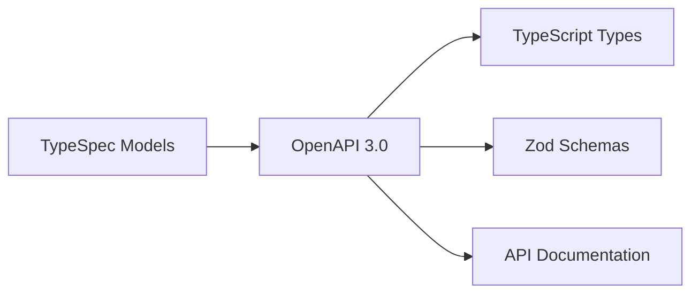
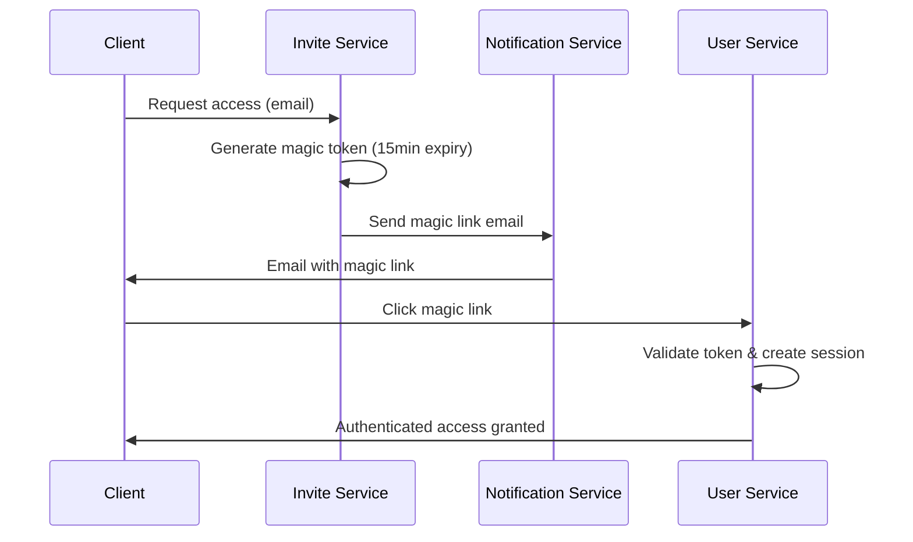

# Solution Architecture Document (SAD)
## Temps D'arrêt Studio - Photography Platform

**Document Version:** 1.0  
**Date:** 2024-08-14  
**Architecture Team:** Solution Architecture  
**Project:** Photography Portfolio & Client Portal Platform  

---

## Executive Summary

### Business Context
Temps D'arrêt Studio is a professional photography business requiring a modern platform to showcase work and deliver services to clients. The platform must handle large photography files (25MB+ RAW images), provide secure client access, and support the complete photography business workflow from client acquisition through photo delivery.

### Architectural Vision
This solution implements a **microservices-based, event-driven architecture** that scales from simple deployment (V1) to advanced distributed systems (V2+). The architecture prioritizes **client experience**, **data privacy**, and **cost efficiency** through self-hosted infrastructure.

### Key Architectural Decisions
- **Event-driven microservices** for business logic coordination
- **Self-hosted infrastructure** for cost control and privacy
- **Schema-first development** using TypeSpec for API consistency
- **Role-based access control** (Photographer, Client, Guest)
- **Progressive technology adoption** from monolith to microservices

---

## Table of Contents

1. [Business Requirements](#business-requirements)
2. [Architectural Views](#architectural-views)
3. [Technology Stack](#technology-stack)
4. [Service Architecture](#service-architecture)
5. [Integration Patterns](#integration-patterns)
6. [Security Architecture](#security-architecture)
7. [Infrastructure Design](#infrastructure-design)
8. [Implementation Roadmap](#implementation-roadmap)
9. [Risk Assessment](#risk-assessment)
10. [Appendices](#appendices)

---

## Business Requirements

### Functional Requirements

#### Core Business Capabilities
- **Portfolio Management**: Public showcase of photography work with SEO optimization
- **Client Portal**: Secure, passwordless access to private photo galleries
- **File Management**: Handle 25MB+ RAW files with multi-resolution processing
- **Archive Services**: Generate and deliver 50-300GB complete photo collections
- **Guest Sharing**: Client-initiated sharing with limited permissions
- **Communication**: Automated email notifications and status updates

#### User Roles & Permissions
```
┌─────────────┬──────────────┬──────────────┬──────────────┐
│ Capability  │ Photographer │ Client       │ Guest        │
├─────────────┼──────────────┼──────────────┼──────────────┤
│ Gallery     │ Full Admin   │ Full Access  │ View Only    │
│ Downloads   │ All Files    │ All + RAW    │ Print Only   │
│ Archives    │ Generate     │ Download     │ None         │
│ Invitations │ Create       │ Invite Guest │ None         │
└─────────────┴──────────────┴──────────────┴──────────────┘
```

### Non-Functional Requirements

#### Performance Targets
- **Page Load Times**: < 2s initial load, < 1s navigation
- **File Upload**: Support 25MB+ files with progress indication
- **Archive Generation**: Handle 300GB collections efficiently
- **Magic Link Delivery**: < 5s email delivery time

#### Security Requirements
- **Zero unauthorized access** to client galleries
- **Magic link authentication** with 15-minute expiry
- **Role-based permissions** strictly enforced
- **Data sovereignty** through self-hosted infrastructure

#### Scalability Requirements
- **Horizontal scaling** of individual services
- **Event-driven architecture** for loose coupling
- **Stateless services** for cloud deployment flexibility

---

## Architectural Views

### 1. Business Architecture View

**Purpose**: Strategic view showing business capabilities, stakeholders, and value streams


**Key Business Processes:**
1. **Shoot-to-Delivery Process**: Photography session → Client invitation → Photo upload → Client access → Download delivery
2. **Guest Access Process**: Client invitation → Limited access → Print-quality downloads
3. **Portfolio Management Process**: Photo curation → Portfolio publishing → Public website update

### 2. Application Cooperation View

**Purpose**: Shows how application services collaborate and integrate


**Core Application Components:**
- 🔵 **Application Layer** (Blue): Web Frontend, API Gateway, Auth, Shoot Management, File Processing, Communication, Portfolio, Configuration
- 🟢 **Technology Layer** (Green): Event Bus (Kafka), Schema Registry (TypeSpec)

**Cooperation Patterns:**
- **Synchronous**: Frontend ↔ API Gateway ↔ Services
- **Asynchronous**: Services ↔ Event Bus ↔ Services
- **Schema-First**: TypeSpec contracts ensure API consistency

### 3. Application Realization View

**Purpose**: Maps business capabilities to technology implementation


**Realization Mapping:**
- **Business Capabilities** → **Application Services** → **Technology Components**
- **Portfolio Showcase** → Portfolio Service + SvelteKit → TypeScript + MongoDB
- **Client Authentication** → User + Invite Services → JWT + Magic Links
- **File Management** → File Service → Node.js + Sharp + File System

### 4. Sequence Diagram: Shoot Creation Flow

**Purpose**: Detailed event-driven workflow for core business process


**Event Flow:**
1. Photographer creates shoot → `shoot.created` event
2. User Service processes client → `user.created/verified` event
3. Invite Service generates magic link → `invite.created` event
4. Notification Service sends email → `invite.sent` event

---

## Technology Stack

### Frontend Technology
```yaml
Framework: SvelteKit v2.26.0
Language: TypeScript v5.8.3
Styling: TailwindCSS + DaisyUI v4.12.0
Testing: Vitest v3.2.4 + Coverage
Build: Vite v7.0.6
```

### Backend Technology
```yaml
Framework: Fastify v5.4.0
Language: TypeScript v5.8.3
Runtime: Node.js 24+
Process Manager: tsx v4.20.3 (development)
```

### Data & Integration
```yaml
Database: MongoDB + Mongoose v8.16.4
Event Streaming: Kafka (production)
Schema Definition: TypeSpec v1.2.1 → OpenAPI 3.0
Validation: Zod v4.0.10
File Processing: Sharp v0.34.3
```

### Development & Operations
```yaml
Package Management: npm workspaces (monorepo)
Testing: Vitest + component testing
Linting: ESLint v9.12.0 + Prettier v3.0.0
Git Hooks: Husky v9.0.0 + Commitlint
Containerization: Docker + Docker Compose
```

---

## Service Architecture

### Microservices Inventory

#### Core Business Services

**Authentication Application**
- **Services**: User Service + Invite Service
- **Responsibilities**: Magic link authentication, user management, role-based access
- **Events Published**: `user.created`, `user.authenticated`, `invite.created`, `invite.accepted`
- **Data Owned**: Users, Authentication tokens, Invitations

**Shoot Management Application**
- **Services**: Shoot Service
- **Responsibilities**: Photography session lifecycle, gallery organization, client assignments
- **Events Published**: `shoot.created`, `shoot.updated`, `shoot.published`
- **Data Owned**: Shoots, Client assignments, Gallery metadata

**File Processing Application**
- **Services**: File Service
- **Responsibilities**: Large file uploads, multi-resolution processing, archive generation
- **Events Published**: `file.uploaded`, `file.processed`, `archive.ready`
- **Data Owned**: File metadata, Processing status, Archive tracking

**Communication Application**
- **Services**: Notification Service
- **Responsibilities**: Email notifications, status updates, template rendering
- **Events Consumed**: `invite.created`, `shoot.ready`, `archive.ready`
- **External Integration**: SMTP email service

#### Supporting Services

**Portfolio Application**
- **Services**: Portfolio Service
- **Responsibilities**: Public website content, marketing showcase, SEO
- **Events Published**: `portfolio.updated`
- **Data Owned**: Public portfolio content, SEO metadata

**Configuration Application**
- **Services**: Content Management Service
- **Responsibilities**: Email templates, system configuration, business rules
- **API Pattern**: Direct service calls (no event consumption)
- **Data Owned**: Templates, Configuration, Business settings

### Service Communication Patterns

#### Synchronous Communication (REST API)
```
Frontend → API Gateway → Individual Services
Services → Content Management Service (templates)
```

#### Asynchronous Communication (Events)
```
Service → Event Bus (Kafka) → Consuming Services
Primary Pattern: Event-driven business logic coordination
```

#### Schema Coordination
```
TypeSpec Contracts → API Generation → Service Implementation
Ensures type safety and API consistency across services
```

---

## Integration Patterns

### Event-Driven Architecture

#### Kafka Topics & Event Flows

**Core Business Events:**
```yaml
shoot.created: Shoot Service → User, Invite, File Services
user.created: User Service → Invite, Shoot Services  
invite.created: Invite Service → Notification Service
file.processed: File Service → Shoot, Notification Services
archive.ready: File Service → Notification Service
```

**Event Schema Example:**
```typescript
interface ShootCreatedEvent {
  eventId: string;
  timestamp: ISO8601;
  shootId: string;
  photographerId: string;
  clientEmail: string;
  metadata: {
    title: string;
    date: ISO8601;
    location?: string;
  };
}
```

#### Event Processing Guarantees
- **At-least-once delivery** via Kafka consumer groups
- **Idempotent event handlers** prevent duplicate processing
- **Dead letter queues** for failed event processing
- **Event sourcing** provides complete audit trail

### API Integration Patterns

#### Schema-First Development


#### Request/Response Patterns
- **Command Pattern**: API Gateway → Service commands
- **Query Pattern**: Service data retrieval via REST
- **Template Pattern**: Services → CMS for content templates

---

## Security Architecture

### Authentication & Authorization

#### Magic Link Authentication Flow


#### Role-Based Access Control (RBAC)
```typescript
type UserRole = 'photographer' | 'client' | 'guest';

interface PermissionMatrix {
  photographer: ['admin', 'all_access'];
  client: ['view_gallery', 'download_all', 'download_archive', 'invite_guest'];
  guest: ['view_gallery', 'download_print_quality']; // NO archive, NO RAW
}
```

### Data Protection

#### Privacy by Design
- **Self-hosted infrastructure** ensures complete data control
- **Client data isolation** through shoot-based permissions
- **Guest access limitations** prevent unauthorized file access
- **Automatic link expiry** limits access window

#### File Security
- **Signed URLs** with expiration for secure file downloads
- **Role-based file access** enforced at service level
- **No direct file system access** from public interfaces
- **Archive encryption** for large file collections

---

## Infrastructure Design

### Self-Hosted Architecture

#### Deployment Strategy
```yaml
V1 Production Stack:
  Container Platform: Docker + Docker Compose
  Web Server: Nginx (reverse proxy + SSL termination)
  SSL Management: Let's Encrypt with auto-renewal
  Database: MongoDB (containerized)
  Event Bus: Kafka (development: in-memory, production: containerized)
  File Storage: Local file system with backup strategy
```

#### Infrastructure Benefits
- **Cost Control**: No cloud storage fees for 150GB+ photo collections
- **Data Sovereignty**: Complete control over client files and privacy
- **Performance**: Local file serving without bandwidth limitations
- **Customization**: Tailored infrastructure for photography workflows

### Scalability Design

#### Horizontal Scaling Strategy
```yaml
Load Distribution:
  - API Gateway: Multiple instances behind load balancer
  - Services: Independent scaling based on demand
  - File Processing: Queue-based scaling for large uploads
  - Event Bus: Kafka partitioning for parallel processing

Storage Scaling:
  - File System: Expandable storage volumes
  - Database: MongoDB replica sets for read scaling
  - Archives: Automatic cleanup of expired large files
```

#### Performance Optimization
- **Multi-resolution image processing** reduces bandwidth
- **Progressive image loading** improves user experience  
- **Resume-capable downloads** for large files
- **CDN integration** ready for V2 global scaling

---

## Implementation Roadmap

### Phase 1: Foundation (V1.0) - Simplified Deployment
**Timeline**: 3-4 months  
**Architecture**: Monorepo with service structure, Docker Compose deployment

**Deliverables:**
- ✅ Monorepo setup with TypeScript configuration
- ✅ SvelteKit frontend with basic portfolio and client portal
- ✅ API Gateway with authentication proxy
- ✅ Core services: User, Shoot, File, Notification
- ✅ MongoDB data layer with business entities
- ✅ Magic link authentication system
- ✅ Basic file upload and multi-resolution processing
- ✅ Email notification system
- ✅ Docker containerization and deployment scripts

### Phase 2: Event-Driven Services (V1.5) - Service Separation
**Timeline**: 2-3 months  
**Architecture**: Event-driven microservices with Kafka

**Deliverables:**
- 🔄 Kafka event bus implementation
- 🔄 Service-to-service event communication
- 🔄 Event sourcing and audit trail
- 🔄 Advanced file processing workflows
- 🔄 Large archive generation (50-300GB)
- 🔄 Guest invitation and access control
- 🔄 Portfolio management for public website

### Phase 3: Production Hardening (V2.0) - Advanced Features
**Timeline**: 2-3 months  
**Architecture**: Full microservices with advanced operations

**Deliverables:**
- 🔄 Kubernetes orchestration
- 🔄 Advanced monitoring and observability
- 🔄 CI/CD pipeline automation
- 🔄 Performance optimization
- 🔄 Advanced security features
- 🔄 Mobile-responsive optimizations
- 🔄 Analytics and business intelligence

### Migration Strategy
- **Gradual service extraction** from monolith
- **Event-driven migration** with backward compatibility
- **Zero-downtime deployments** using blue-green strategy
- **Data migration scripts** with rollback capabilities

---

## Risk Assessment

### Technical Risks

| Risk | Impact | Probability | Mitigation Strategy |
|------|--------|-------------|-------------------|
| **Large File Performance** | High | Medium | Multi-resolution processing, progressive loading, resume-capable downloads |
| **Event Processing Failures** | High | Low | Dead letter queues, retry mechanisms, monitoring alerts |
| **Self-hosted Infrastructure** | Medium | Medium | Professional hosting, backup strategies, monitoring |
| **Magic Link Security** | High | Low | Short expiry times, one-time use, secure token generation |
| **Service Integration Complexity** | Medium | Medium | Schema-first development, comprehensive testing, gradual rollout |

### Business Risks

| Risk | Impact | Probability | Mitigation Strategy |
|------|--------|-------------|-------------------|
| **Client Data Privacy** | High | Low | Self-hosted infrastructure, encryption, access controls |
| **Cost Overruns** | Medium | Medium | Self-hosted approach, clear technology choices, phased delivery |
| **User Experience Issues** | High | Medium | User testing, progressive enhancement, mobile-first design |
| **Vendor Lock-in** | Low | Low | Open source technology stack, standard protocols |

### Operational Risks

| Risk | Impact | Probability | Mitigation Strategy |
|------|--------|-------------|-------------------|
| **Service Availability** | High | Medium | Health monitoring, automated recovery, backup systems |
| **Data Loss** | High | Low | Automated backups, replication, disaster recovery procedures |
| **Security Breaches** | High | Low | Role-based access, short-lived tokens, security audits |
| **Performance Degradation** | Medium | Medium | Performance monitoring, capacity planning, optimization |

---

## Quality Assurance

### Testing Strategy

#### Service Testing
```yaml
Unit Tests: Individual service components with role validation
Integration Tests: Service-to-service communication with permission checks  
End-to-End Tests: Complete user workflows for each role
Performance Tests: Large file handling and archive generation
Security Tests: Authentication, authorization, role-based access control
```

#### Event-Driven Testing
```yaml
Event Publishing: Verify correct event schemas and delivery
Event Consumption: Test idempotent event handlers
Event Ordering: Validate business process sequences
Event Failure: Test dead letter queue and retry mechanisms
```

### Performance Benchmarks
```yaml
File Upload: 25MB upload in < 30s on 10Mbps connection
Image Processing: 4 resolutions generated in < 60s
Archive Generation: 1GB per minute processing rate
Magic Link Delivery: < 5s end-to-end email delivery
Gallery Loading: < 2s initial load, < 1s navigation
```

---

## Monitoring & Operations

### Observability Strategy

#### Application Monitoring
- **Service health checks** via HTTP endpoints
- **Event processing metrics** (throughput, latency, failures)
- **Business metrics** (shoots created, files processed, downloads)
- **User experience metrics** (page load times, error rates)

#### Infrastructure Monitoring
- **System resources** (CPU, memory, disk, network)
- **Container health** (Docker container status)
- **Database performance** (MongoDB operations, connections)
- **File system usage** (storage capacity, backup status)

#### Alerting Strategy
```yaml
Critical Alerts: Service unavailability, security breaches, data corruption
Warning Alerts: Performance degradation, resource utilization, failed events
Info Alerts: Deployment completions, backup status, capacity planning
```

### Operational Procedures

#### Deployment Process
1. **Code Review** and automated testing
2. **Staging Deployment** with integration testing
3. **Production Deployment** with blue-green strategy
4. **Health Verification** and rollback procedures
5. **Performance Monitoring** and optimization

#### Incident Response
1. **Detection** via monitoring alerts
2. **Assessment** of impact and severity
3. **Mitigation** with immediate fixes
4. **Communication** to stakeholders
5. **Post-incident Review** and improvements

---

## Appendices

### Appendix A: API Specifications
- [OpenAPI 3.0 Documentation](../api/index.html)
- [TypeSpec Model Definitions](../../packages/models/)
- [Event Schema Specifications](../events/)

### Appendix B: Deployment Guides
- [Development Environment Setup](../../README.md)
- [Docker Deployment Guide](../../infrastructure/docker/)
- [Production Deployment Checklist](../../infrastructure/scripts/)

### Appendix C: Security Documentation
- [Authentication Flow Specifications](../diagrams/Sequence%20diagrams/)
- [Role-Based Access Control Matrix](../Functional-scenarios.md)
- [Security Audit Checklist](../../SECURITY.md)

### Appendix D: Architectural Decision Records (ADRs)
- [ADR-001: Event-Driven Architecture Choice](./adrs/001-event-driven-architecture.md)
- [ADR-002: Self-Hosted Infrastructure Decision](./adrs/002-self-hosted-infrastructure.md)
- [ADR-003: Magic Link Authentication Strategy](./adrs/003-magic-link-authentication.md)
- [ADR-004: TypeScript and Schema-First Development](./adrs/004-schema-first-development.md)

---

## Document Control

**Version History:**
| Version | Date | Author | Changes |
|---------|------|--------|---------|
| 1.0 | 2024-08-14 | Solution Architecture Team | Initial comprehensive architecture document |

**Review and Approval:**
- **Technical Review**: Solution Architect
- **Business Review**: Product Owner  
- **Security Review**: Security Architecture Team
- **Final Approval**: Engineering Director

**Next Review Date**: 2024-11-14 (Quarterly Review)

---

*This Solution Architecture Document serves as the authoritative reference for all architectural decisions, patterns, and implementation guidance for the Temps D'arrêt Studio photography platform.*